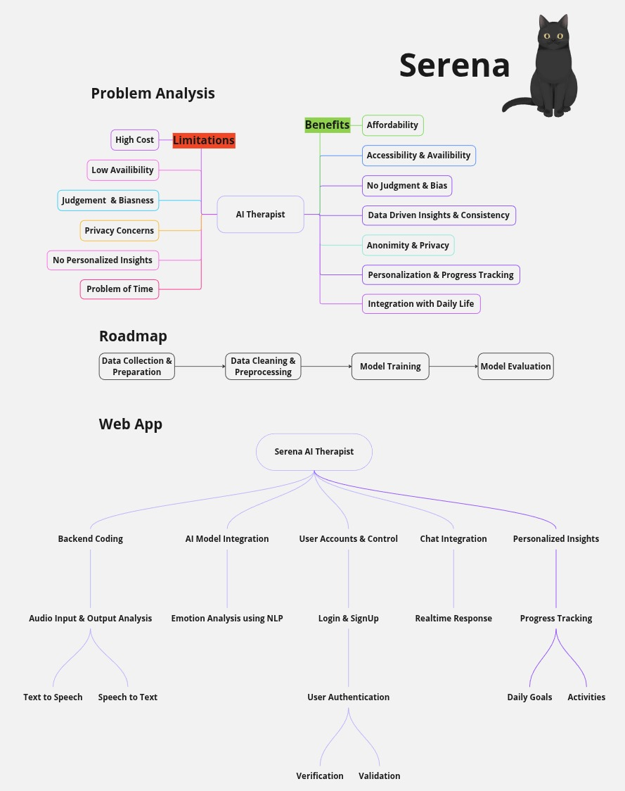

# Serena: A Personalized AI Therapist

Serena is an innovative AI Therapist agent designed to provide accessible, personalized, and real-time mental well-being support. Leveraging advanced AI models and a responsive web interface, Serena aims to make therapeutic interactions more approachable and convenient.

## Project Overview

The core idea behind Serena is to address common limitations in traditional therapy, such as high cost, limited availability, and privacy concerns, by offering an AI-powered alternative that provides judgment-free, data-driven, and personalized insights.


<div align="center">
  
</div>

## Features

*   **Real-time Audio Interaction:** Engage with Serena using your voice, with real-time audio input and natural-sounding audio output.
*   **Live 2D Character Animation:** Experience a visually engaging interaction with a responsive 2D character (currently a charming cat model) that performs real-time lipsync synchronized with Serena's spoken responses.
*   **Personalized Insights & Progress Tracking:** Serena can track your daily goals and activities to provide tailored feedback and help you monitor your well-being journey.
*   **Secure User Management:** Features include robust login and registration processes with user authentication, securely saving user information in an SQLite database.
*   **Advanced AI Capabilities:** Powered by state-of-the-art Large Language Models for empathetic and context-aware responses.


### Real-time Interaction

Serena is designed for dynamic and immersive interactions. This project features real-time audio input and output capabilities. When you speak, your words are instantly processed, and Serena responds verbally, synchronized with a delightful Live2D character.

The animated character, currently a charming cat model, provides real-time lipsync, making the interaction feel incredibly natural and engaging. This visual feedback enhances the user experience, providing a sense of connection and presence during your therapeutic conversations.

This seamless integration of audio processing, AI response, and visual animation creates a unique and effective way to engage with an AI therapist.

<div style="clear: both;"></div>

### Frontend

*   **TypeScript:** The main frontend logic is written in TypeScript and Live2D SDK, providing type safety and better maintainability.
*   **Node.js:** Used for compiling the TypeScript code into the `index-ccc.js` file, which powers the web interface.
*   **JavaScript Web Speech API:** Utilizes the browser's built-in `SpeechRecognizer` for efficient and real-time Speech-to-Text conversion from user audio input, managed by a convenient toggle button on the page.
*   **WebSockets:** Implemented to facilitate real-time, bidirectional communication between the frontend and the Flask backend, primarily for sending audio and receiving responses.

### Backend

*   **Flask:** The entire backend is built using Flask, a lightweight Python web framework.
*   **WebSockets:** Flask-based WebSockets are used to send processed audio and lipsync data back to the frontend, ensuring a smooth, real-time experience.
*   **SQLite:** Employed as the database solution within Flask to securely store user registration and login information.

### AI & Core Models

*   **Large Language Model (LLM):**
    *   **Previous Model:** Gemini 1.5 Flash (initially fine-tuned and used).
    *   **Current Model:** Gemini 2.0 Flash Lite. This model is currently in use, replacing the deprecated previous version, and continues to provide excellent results for generating therapeutic responses.
    *   **Fine-tuning:** The LLM was fine-tuned using a dedicated dataset located in the `dataset` folder. This data was preprocessed to optimize the model's performance for therapeutic conversations.
*   **Text-to-Speech (TTS):** **Piper-TTS** is utilized for high-quality, natural-sounding audio synthesis of Serena's responses, ensuring a pleasant listening experience.
*   **Emotion Analysis using NLP:** Initilly Integrated it to understand the emotional context of user input, allowing for more nuanced and empathetic AI responses, but removed from the current code as LLM model itself understands it.

### 2D Model Integration

*   **Live2D SDK Sample Model:** A Live2D SDK sample model (currently a cat character) is rendered on the page. Custom code has been implemented to render this model and perform real-time lipsync based on the audio output generated by Piper-TTS.

## How It Works

1.  **User Input:** The user speaks into their microphone.
2.  **Speech-to-Text (Frontend):** The JavaScript `SpeechRecognizer` converts the real-time audio into text.
3.  **Data Transmission:** The text input is sent to the Flask backend.
4.  **AI Processing (Backend):**
    *   The Flask backend receives the text.
    *   The Gemini 2.0 Flash Lite LLM processes the text to generate a therapeutic response.
    *   The response text is then fed into Piper-TTS to generate high-quality audio.
    *   Lipsync is done automatically by Live2D when the sudio is played in it by analyzing the amplitude of the audio being played.
5.  **Response Transmission (WebSocket):** The generated audio file is sent to the frontend via WebSocket.
6.  **Real-time Output (Frontend):**
    *   The frontend plays the audio.
    *   The custom rendering code animates the Live2D model, synchronizing its lips with the spoken audio in real-time.

## How to Run it

### 1. Clone the Repository

To run this first clone the repo by using this command:

```bash
git clone https://github.com/LovejeetM/Serena.git 
cd Serena
```

### 2. Create Python virtual environment on your machine

run this in command prompt to create it (Windows command):
```bash
python -m venv venv
```
then, activate it using:
```bash
venv\Script\activate
```

### 3. Install the required dependencies

To install from requirements.txt run:
```bash
pip install -r requirements.txt
```

### 4. Create Dotenv file for api key and database key

create ".env" file in the current directory and paste your gemini api key there and also create a database instance and give it your key and include it in .env for storing login information like this:

```bash
API_KEY= "  ---------- Your key ------------ "
DB_KEY= " -----Your key----- "
```

### 5. You are all set

Now you can run the main app from the terminal and then follow the local address to test the app:

```bash
python app.py
```

## Learnings

This project has been a valuable learning experience, particularly in understanding and implementing **fine-tuning concepts for Large Language Models** of llm models and **learning/analyzing large Typescript codebase of Live2D**. It has also provided practical insights into real-time audio processing, WebSocket communication, and integrating complex SDKs for interactive web applications.

## Current Status

The project is currently working well, providing a functional and interactive AI therapist experience, but needs substantial updates for increasing speed of giving responses as currently it is sending file to the frontend when the whole file is generated, but we can stream the audio to the frontend as it is being produced providing massive speedboost.


## Disclaimer

**Please note:** The Live2D model and SDK used in this project are the proprietary property of **Live2D Inc.** They are included for demonstration purposes only within this project. This repository primarily contains the compiled JavaScript code (`index-ccc.js`) that renders the Live2D model. The main TypeScript source code used for building and interacting with the Live2D SDK can be found and licensed through the official Live2D website and its documentation. This project does not claim ownership of the Live2D SDK or its sample assets.
